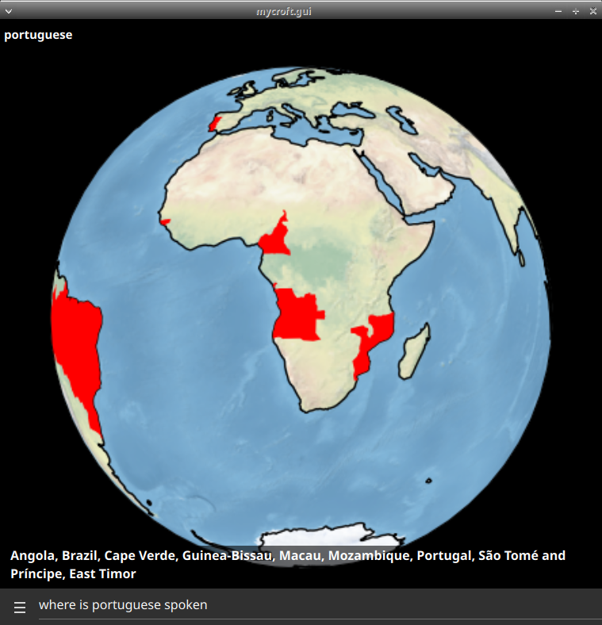
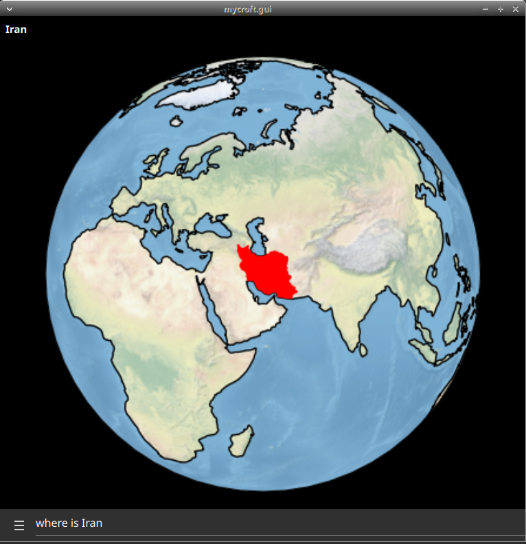
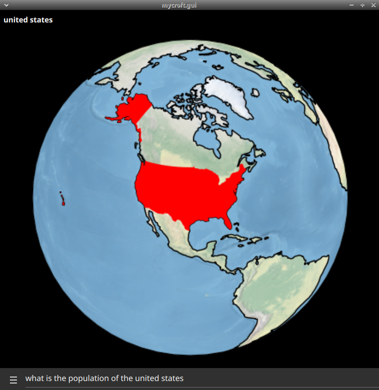
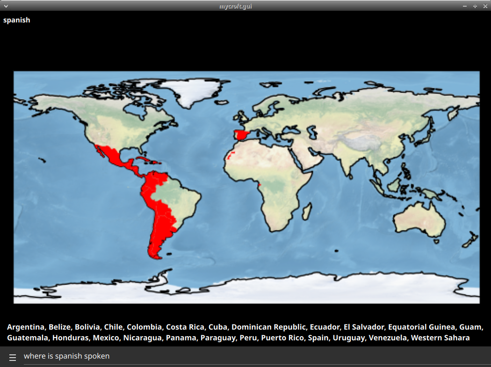
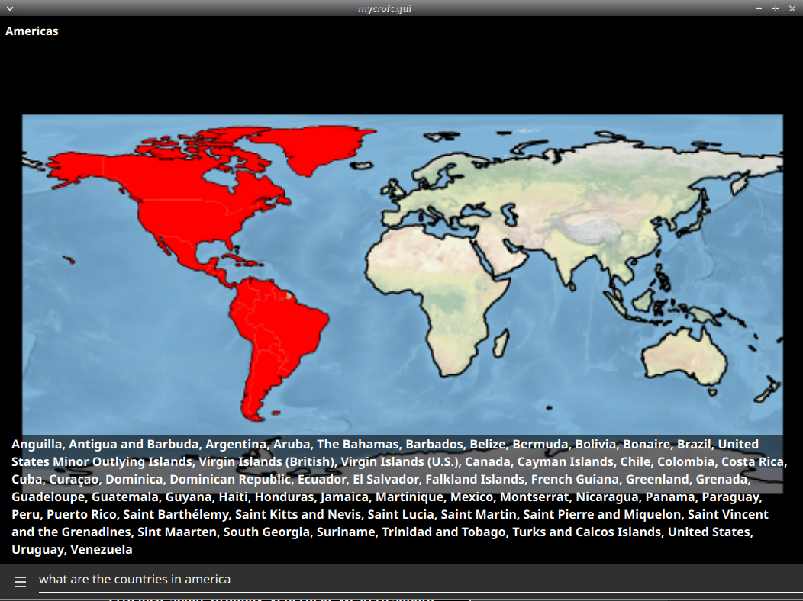

#  Countries

data about countries from http://restcountries.eu/

## description

country population, area, language, borders, currency, timezone, capital, denonyms...

## usage

* "what is the size of portugal"
* "what are the borders of portugal"
* "what is the capital of portugal"
* "what is the currency of portugal"
* "what is the language of portugal"
* "what is the population of portugal"
* "what is the timezone of portugal"
* "what are the people that live in portugal called"
* "where is portuguese spoken"
* "where is portugal located at"
* "how many countries do you know about"
* "what are the countries in europe"

## TODO

* "use units when speaking country area
* "fix timezone spellings to use natural language
* better region matching
* use .dialog files everywhere, currently country lists are lazy responses
* websettings for mapstyle
* improve requirements handling, cartopy is optional for gui

# Platform support

- :heavy_check_mark: - tested and confirmed working
- :x: - incompatible/non-functional
- :question: - untested
- :construction: - partial support

|     platform    |   status   |  tag  | version | last tested | 
|:---------------:|:----------:|:-----:|:-------:|:-----------:|
|    [Chatterbox](https://hellochatterbox.com)   | :question: |  dev  |         |    never    | 
|     [HolmesV](https://github.com/HelloChatterbox/HolmesV)     | :question: |  dev  |         |    never    | 
|    [LocalHive](https://github.com/JarbasHiveMind/LocalHive)    | :question: |  dev  |         |    never    |  
|  [Mycroft Mark1](https://github.com/MycroftAI/enclosure-mark1)    | :question: |  dev  |         |    never    | 
|  [Mycroft Mark2](https://github.com/MycroftAI/hardware-mycroft-mark-II)    | :question: |  dev  |         |    never    |  
|    [NeonGecko](https://neon.ai)      | :question: |  dev  |         |    never    |   
|       [OVOS](https://github.com/OpenVoiceOS)        | :question: |  dev  |         |    never    |    
|     [Picroft](https://github.com/MycroftAI/enclosure-picroft)       | :question: |  dev  |         |    never    |  
| [Plasma Bigscreen](https://plasma-bigscreen.org/)  | :question: |  dev  |         |    never    |  

- `tag` - link to github release / branch / commit
- `version` - link to release/commit of platform repo where this was tested

## Credits

JarbasAI
